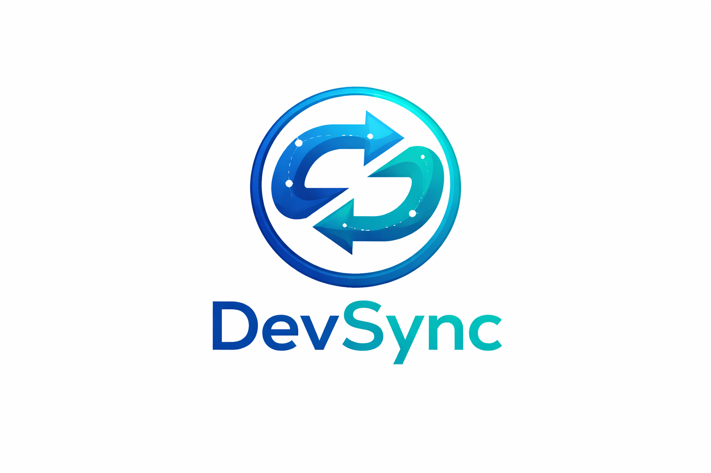

# DevSync

**Your AI teammate before CI fails**

Analyze Git diffs, detect risks and secrets and get actionable AI feedback before code reaches CI/CD.

---

## 🧰 Built With

  
  
  
  
  
  
  
  
  

---

## 🧠 Description

DevSync is an AI powered code review platform built to help developers catch risky changes early.

By analyzing Git diffs before merge or CI execution, DevSync identifies potential bugs, security issues and hardcoded secrets while providing clear explanations and a risk score for every change.

The goal is simple. Ship safer code with more confidence and less guesswork.

---

## ⚙️ How It Works

The user pastes a Git diff into the DevSync interface.  
The frontend sends the diff to the backend API.  
The FastAPI service forwards the request to Gemini for analysis.  
Gemini evaluates the code for risks secrets and improvements.  
The backend returns a structured review with a risk score.  
The frontend displays the results in a side by side diff view.

---

## ✨ Features

- AI powered Git diff analysis  
- Risk scoring for code changes  
- Secret detection with masking toggle  
- Adjustable review strictness and context  
- Exportable reviews in Markdown format  

---

## 🌍 Live Deployment

- **Frontend:** https://devsync-seven.vercel.app/

