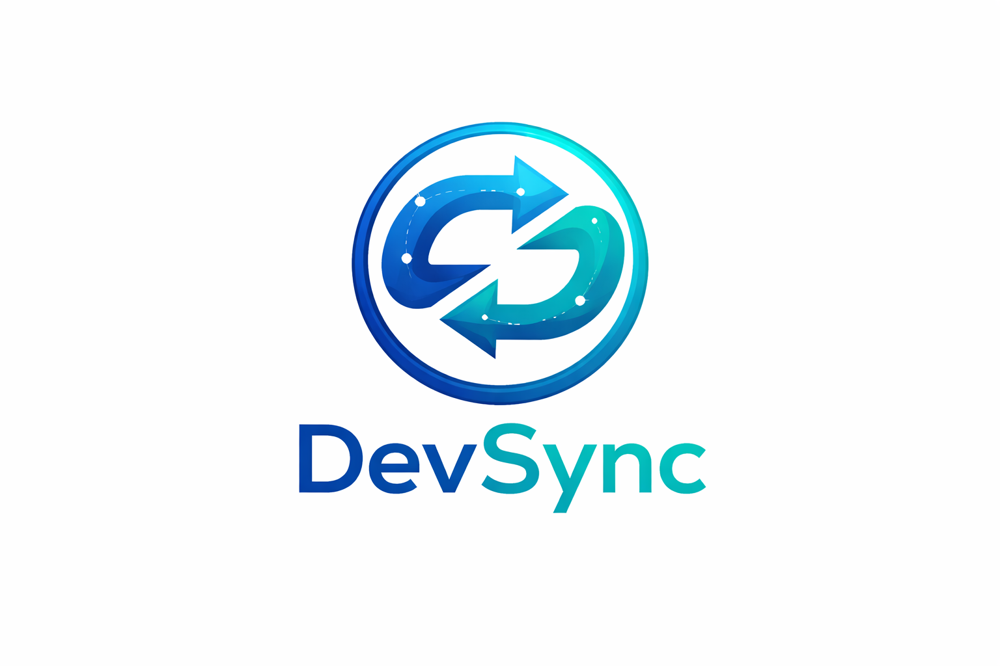

<div align="center">


# DevSync
**Your AI teammate before CI fails**

Analyze Git diffs, detect risks and secrets and get actionable AI feedback before code reaches CI/CD.

</div>

---

## 🧰 Built With

<p align="center">
  
  
  
  
  
  
  
</p>

---

## 🧠 Description

DevSync is an AI powered code review platform built to help developers catch risky changes early.

By analyzing Git diffs before merge or CI execution, DevSync identifies potential bugs, security issues and hardcoded secrets while providing clear explanations and a risk score for every change.

The goal is simple. Ship safer code with more confidence and less guesswork.

---

## ⚙️ How It Works

1. The user opens a pull request on GitHub — or pastes a Git diff into the DevSync interface.
2. The GitHub App webhook fires automatically on every PR open or update.
3. The FastAPI backend fetches the PR diff and loads the repo's `.devsync.yml` config.
4. The diff is forwarded to Gemini for analysis with per-repo strictness and context rules applied.
5. Gemini evaluates the code for risks, secrets, and improvements.
6. The backend returns a structured review with a risk score and posts inline comments directly on the PR.
7. A GitHub Check run marks the PR as pass, warn, or fail based on the risk threshold.
8. The frontend displays results in a side-by-side diff view and team dashboard.

---

## ✨ Features

- AI powered Git diff analysis
- Risk scoring for code changes
- Secret detection with masking toggle
- Adjustable review strictness and context
- Exportable reviews in Markdown format
- **GitHub App integration** — auto-reviews every pull request with inline comments and check runs
- **`.devsync.yml` config** — per-repo rules for ignored paths, secret patterns, strictness, and block thresholds
- **Team risk dashboard** — aggregate risk trends, hotspot repos, and per-author breakdowns

---

## 🔧 GitHub App Setup

Install the DevSync GitHub App on any repo to enable automatic PR reviews.

1. Open a pull request on a repo with DevSync installed
2. DevSync posts a review comment with risk score and inline findings
3. The PR check passes, warns, or blocks merge based on your configured threshold

Add a `.devsync.yml` to your repo root to customize behavior:

```yaml
strictness: 3          # 1–5, default 3
block_on_score: 7      # fail the check if risk score exceeds this
ignore_paths:
  - "*.md"
  - "tests/**"
  - "migrations/**"
secret_patterns:
  - "sk_live_"
  - "AKIA"
context: "This is a fintech app. Flag any unencrypted financial data."
```

---

## 🌍 Live Deployment

- **Frontend:** https://devsync-seven.vercel.app/
- **Backend:** https://devsync-backend-2j88.onrender.com

